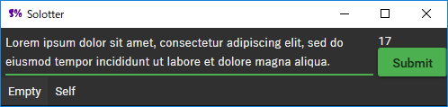

# Solotter
A twitter client for those who want to stay focused on the work.



## Features
- Submit tweets.
- Show your tweets.

## Usage
- [Download the latest release](https://github.com/vain0/VainZero.Solotter/releases/latest).
- Unzip.
- Execute `Solotter.exe`.

## Build
- Before build, restore packages by executing the following commands in the `sources` directory:

```
.paket\paket.bootstrapper.exe
.paket\paket.exe install
```

- Build the solution with Visual Sudio 2015.
- Add ``VainZero.Solotter.AccessToken.xml`` to the directory of the executable. It is included in release packages.
